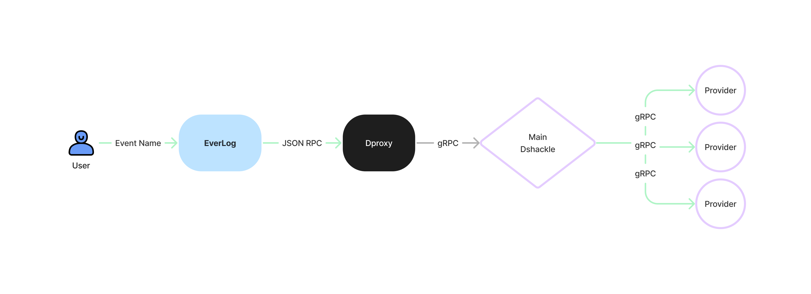

Unlock the true potential of blockchain data with EverLog's cutting-edge tools powered by gRPC, and take your exploration to new heights beyond the limits of JSON RPC.

### Workflow

## Overview

An indexer extracts transaction data from a blockchain node, transforms it into a readable format, and loads it into a database for easy querying. On-chain data is not searchable by default, which is a challenge for developers building dApps that can interact with on-chain data. The ability to query on-chain data is crucial for efficient and user-friendly dApps.

### What EverLog offers

- **Effortless Event Retrieval:** No more sifting through raw blockchain data. EverLog categorizes and indexes events, making them readily accessible for exploration and analysis.

- **Seamless Integration:** Integrate EverLog with your existing dApps or applications to gain valuable insights from past and ongoing blockchain activity.

- **Powerful Querying:** Utilize an intuitive interface to filter and search through logged events, allowing you to pinpoint specific information with ease.

- **Secure Storage:** Rest assured that your data is protected. EverLog leverages a robust database to ensure the safe and reliable storage of collected blockchain events.

### Deployed Contract (Testnet)
A sample of an event in a contract: 'log'

[deployment tx](https://sepolia.etherscan.io/tx/0xe2ae53c19f6676c75c5549f85558f7f159966f310c6ac285c5086a6b74ec1ff1)

Sepolia Testnet: contract address `0x654c9F59103a1a0356CB5D6D4AB55c4D14fb1280` [view on explorer](https://sepolia.etherscan.io/address/0x654c9f59103a1a0356cb5d6d4ab55c4d14fb1280#code)

### Contributing

Pull requests are welcome. For major changes, please open an issue first to discuss what you would like to change.

## License

Distributed under the [MIT](https://choosealicense.com/licenses/mit/) License.
